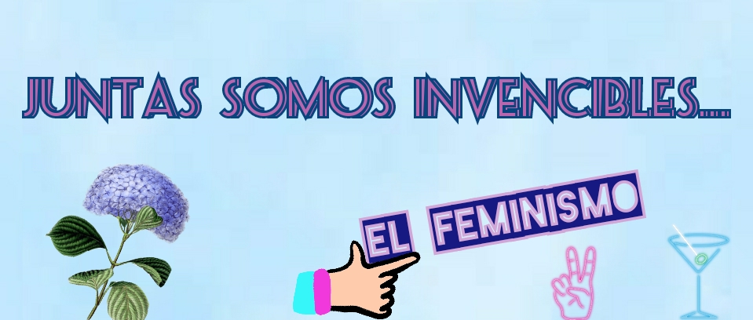

<html>

<head>
<tittle>Feminismo
</tittle>
</head>

<body background="fondo.gif"><meta charset="utf-8">
 
 
 
 
 

<table border="0" bgcolor="#e3ccef" width="86%">
<tr>
<td>
   

   
</td>
</tr>
</table>

<table border="0" bgcolor="#55d2a5" width="86%">
<tr>
<td>

<table border="0" bgcolor="#F27EF8" width="75%" align="right">
<tr>
<td>  

<h1 style="color:#671F6D;"><a name="que es">¿Qué es el feminismo?</a></h1>

 
 
<table border="0" bgcolor="#F27EF8" width="90%" align="center">
<tr>
<td>

El feminismo es un movimiento político y social, una teoría política y una perspectiva filosófica que postula el «principio de igualdad de derechos de la mujer y el hombre». Lucha por el reconocimiento de las mujeres como sujetos humanos y sujetos de derecho y sostiene que ningún ser humano debe ser privado de ningún bien o derecho a causa de su sexo. Busca conseguir que las mujeres tengan iguales libertades que los hombres​ y busca eliminar la dominación y violencia de los varones.

Es una ideología y movimiento social que pide para las mujeres el reconocimiento de capacidades y derechos que tradicionalmente han estado aprobados o bien vistos para los hombres; sin embargo, no son sólo ésas las causas por las que el movimiento feminista se manifiesta. Hechos como la violencia (en cualquiera de sus modalidades) o feminicidios, también se persiguen con esta corriente.

 

 

El feminismo no es odiar a los hombres, ni querer la supremacía de las mujeres. No es una moda, aunque efectivamente, está de moda, es mucho más que eso. La Real Academia Española (RAE) define el feminismo como “el principio de igualdad de derechos de la mujer y el hombre así como el movimiento que lucha por la realización efectiva en todos los órdenes del feminismo”. Aún así, todavía hay cierta reticencia a declararse abiertamente feminista o a apoyar esta ideología por parte de algunos grupos a causa del desconocimiento de su significado.

Actualmente, se entiende que existen muchos tipos de mujeres, de raza negra, islámicas, asiáticas, y más. Por esta razón es que se generan muchos más tipos de feminismos, que dependen de características singulares. El día de hoy ya no existe un feminismo único. Aún queda mucho por hacer, todavía existe la violencia de género, la inexistente igualdad salarial y los puestos relevantes son exclusivos para hombres. Pero aun así, el sentido del movimiento es hacer consciencia de que sigue existiendo una desigualdad y que tanto hombres como mujeres podemos conseguir una mejor coexistencia y sociedad.

 
 
 
 

<b><a href="#indice" style="color:#671F6D;">ÍNDICE</a></b>

 
 
 
 
</td>
</tr>
</table>
</td>
</tr>
</table>

<a name="indice">
<table border="0" bgcolor="#55d2a5" width="25%" align="left">
<tr><td>

<h3 style="color:#0B2161;">ÍNDICE  </h3>

</td></tr>
<tr bgcolor="#F27EF8"><td>
<a href="#que es" style="color:navy;"> ✨ ¿Qué es el feminismo?  </a>
</td></tr>
 
<tr bgcolor="#A3E8D7"><td>
<a href="#cómo" style="color:navy;"> ✨ ¿Cómo surgió?  </a>
</td></tr> 
 
<tr bgcolor="#FABEDC"><td>
<a href="#causas" style="color:navy;"> ✨ Causas  
</td></tr>
 
<tr bgcolor="#95CEF4"><td>
<a href="#consecuencias" style="color:navy;"> ✨ Consecuencias  
</td></tr>
 
<tr bgcolor="#FEF6B8"><td>
<a href="#buscan" style="color:navy;"> ✨ ¿Qué buscamos las feministas?  
</td></tr>
 
<tr bgcolor="#feb1b3"><td>
<a href="#mexico" style="color:navy;"> ✨ Feminismo en México  
</td></tr>
 
<tr bgcolor="#fbd19b"><td>
<a href="#malo" style="color:navy;"> ✨ ¿Es algo malo?  
</td></tr>
 
<tr bgcolor="#e3ccef"><td>
<a href="#bibliografía" style="color:navy;"> ✨ BIBLIOGRAFÍA  
</td></tr> 
 
</table>
</a>

<table border="0" bgcolor="#A3E8D7" width="75%" align="right">
<tr>
<td>  

<h1 style="color:#20584B;"><a name="cómo">¿Cómo surgió?</a></h1>

 
 
<table border="0" bgcolor="#A3E8D7" width="90%" align="center">
<tr>
<td>

La lucha del feminismo nace de la idea de que la naturalidad del hombre es ser superior a la mujer, a largo de la historia se generan roles que marcan aún más la diferencia. Es hasta el siglo XVIII que el movimiento Feminista surge como tal. Durante el renacimiento las mujeres tenían prohibido, votar, estudiar y su tiempo se limitaba a las actividades domésticas

Tiempo después surge la Ilustración, un movimiento social que lucha por la igualdad, en ese momento es que se da la Revolución Francesa y la Declaración de los Derechos del Hombre y del Ciudadano, en el que solo se mencionaba al hombre, las mujeres, siendo la mitad de la población no entienden cómo es que se quedaron sin esos mismos derechos por los que los hombres luchaban.

Así inicia la Primera Ola del Feminismo, Olympe de Gouges, una mujer a favor del movimiento replica el mismo documento bajo el nombre de la Declaración de los Derechos de la Mujer y de la Ciudadana, considerado uno de los primeros documentos que señalan la igualdad jurídica y legal de las mujeres, y por otro lado, Mary Wollstonecraft, con su escrito Vindicación de los Derechos de la Mujer, donde señalaba que la diferencia de los géneros no es algo natural como estaba establecido sino cultural e invita a las mujeres a educarse. Este movimiento es reprendido en incluso a Olympe de Gouges se le sentencia a muerte.

En el siglo XIX llega el Código Civil Francés o Código de Napoleón que se extiende por toda Europa y recalcan la sumisión de las mujeres, dejándolas sin derechos. Así llega la Segunda Ola del Feminismo, el Sufragismo, pasa de ser un movimiento intelectual a un movimiento social que toma lugar en Estados Unidos de América e Inglaterra. Lucretia Mott y Elizabeth Cady Stanton inician en EUA con la lucha a favor de los derechos de las mujeres, donde en Seneca Falls escriben la Declaración de Sentimientos, un escrito donde piden la igualdad para la educación y el derecho a votar, porque creen que con este último los demás derechos se otorgarán. Las mujeres comienzan a marchar con manifestaciones, panfletos, aunque durante años fueron sometidas.

Al terminar la segunda guerra mundial inicia la Tercera Ola Feminista, donde los hombres han regresado de la guerra y las mujeres se dedican a las actividades domésticas, es entonces donde la publicidad hace que los roles sigan separando esa idea de igualdad. Hasta que llega Betty Friedan, con su texto Mística de la Feminidad, donde explica la vida insatisfecha que llevan las mujeres que solo se dedican a actividades domésticas y por ver por las necesidades de los demás antes de las suyas. Betty también crea también el movimiento Now, que ve por las necesidades de la mujer en ámbito personal. Así nace el Feminismo Liberal que buscaba la igualdad de los sexos. Esto fue en los años 60.

Si bien la situación laboral, social y educativa había mejorado, dentro de los hogares la situación no cedió, así nace el Feminismo Radical, donde la palabra radical hace referencia a la raíz, al hogar. Éste tipo de feminismo busca eliminar el sistema de dominación del hombre sobre la mujer, o lo que mejor se conoce como el patriarcado. El Feminismo Radical crea espacios propios, como guarderías, ayuda social y más con el objetivo de que la mujer actual cuente con todo el sistema que ella necesita y así otorgar más libertad.

 
 
 
 

<b><a href="#indice" style="color:#20584B;">ÍNDICE</a></b>

 
 
 
 
</td>
</tr>
</table>

</td>
</tr>
</table>

<table border="0" bgcolor="#FABEDC" width="75%" align="right">
<tr>
<td>  

<h1 style="color:#97275B;"><a name="causas">Causas</a></h1>

 
 
<table border="0" bgcolor="#FABEDC" width="90%" align="center">
<tr>
<td>

<b><i>1. Violencia de género:</i></b>Según datos del Ministerio de Sanidad, Servicios Sociales e Igualdad, 2018 se saldó con 47 víctimas mortales por violencia de género, 4 menos que en 2017, 39 menores huérfanos y 27 niños asesinados por violencia machista.

 

<b><i>2. Mutilación genital femenina:</i></b>Según datos de la OMS, se estima que unos 200 millones de mujeres han sido mutiladas en el mundo, principalmente en el continente africano, a pesar de ser una práctica prohibida en la mayoría de los países donde se lleva a cabo (al menos en 30 países de Asia, Oriente Medio, América Latina y África). En la mayoría de los casos se practican en la infancia, entre la lactancia y los 15 años y la OMS estima que 54 millones de menores tienen posibilidades de sufrir mutilación genital hasta el año 2030.

 

<b><i>3. Brecha salarial:</i></b>Según el Informe Mundial sobre Salarios de la OIT (Organización Internacional de Trabajo) de 2018, las mujeres cobraron un 15% menos que los hombres.

 

<b><i>4. Pobreza:</i></b>Según datos de la ONU, el 60% de las personas con hambre crónica son mujeres y niñas.

 

<b><i>5. Educación:</i></b>La ONG Educo ha puesto de manifiesto que 31 millones de niñas menores de 12 años (el 54,39% de los 57 millones de niños en edad escolar en todo el mundo) no van a la escuela.

 

<b><i>6. Aborto:</i></b>En muchos países todavía no es aceptada como una práctica legal, incluso aunque la vida de la madre o el feto estén en peligro. El pasado mes de febrero, en Argentina, una niña de 12 años que había sido violada fue obligada a dar a luz por cesárea por el Gobierno provincial de Tucumán.

 

<b><i>7. Matrimonios forzados:</i></b>Las Naciones Unidas han informado de que más de 14 millones de niñas menores de 18 años se habrán casado en la próxima década. Y el matrimonio no es el único problema, también las complicaciones que pueden surgir en el embarazo y el parto, principal causa de muerte en mujeres entre 15 y 19 años en los países en vías de desarrollo.

 
 
 

 
 
 
 

<b><a href="#indice" style="color:#97275B;">ÍNDICE</a></b>

 
 
 
 
</td>
</td>
</tr>
</table>
</td>
</td>
</table>

<table border="0" bgcolor="#95CEF4" width="75%" align="right">
<tr>
<td>  

<h1 style="color:#0B2161;"><a name="consecuencias">Consecuencias</a></h1>

 
 
<table border="0" bgcolor="#95CEF4" width="90%" align="center">
<tr>
<td>

El feminismo ha tenido una importante influencia en la legislación de gran parte de países del mundo, afectando a amplias áreas del ordenamiento jurídico, con leyes contra la violencia de género o leyes de paridad electoral.

Sin embargo, a pesar de los logros obtenidos, el movimiento feminista reivindica que todavía hay muchos cambios por hacer y que la mujer sigue estando en un estado de vulnerabilidad en contraste con el varón, por ejemplo, en ningún país del mundo se ha logrado igual salario por igual trabajo, el aborto espontáneo sigue siendo causa de muerte de muchas mujeres en el mundo (tercera causa de mortalidad materna en el mundo ) o el hecho de que aún hay muchos países donde las mujeres no tienen derecho a votar en igualdad con los varones.

 
 
 

 
 
 
 

<b><a href="#indice" style="color:#0B2161;">ÍNDICE</a></b>

 
 
 
 
</td>
</tr>
</table>
</td>
</td>
</table>

<table border="0" bgcolor="#FEF6B8" width="75%" align="right">
<tr>
<td>  

<h1 style="color:#928103;"><a name="buscan">¿Qué buscamos las feministas?</a></h1>

  

<table border="0" bgcolor="#FEF6B8" width="90%" align="center">
<tr>
<td>

<b>1.</b> Queremos poder decidir sobre nuestros propios cuerpos y no morir en el intento. Queremos educación sexual para decidir, anticonceptivos para prevenir, y aborto legal (amparado por la salud pública) para no morir. Queremos ser madres por decisión, no por obligación.

<b>2.</b> Queremos poder salir a la calle y viajar sin miedo de que nos violen, acosen, o insulten. Y que luego culpen a nuestra ropa, a que estábamos «solas», o que salimos de noche.

<b>3.</b> Queremos reducir la violencia de género, que afecta desproporcionadamente a las mujeres, teniendo políticas públicas efectivas que protejan y amparen a las víctimas.

<b>4.</b> Queremos paridad salarial. No es mucho pedir el mismo pago por el mismo trabajo.

<b>5.</b> Queremos una cultura donde las mujeres no seamos consideradas putas, perras y zorras por tener una vida sexual equivalente a la de los hombres.

<b>6.</b> Queremos que deje de ser visto como «gajes del oficio» el ser acosadas sexualmente en nuestro espacio de trabajo, estudio y básicamente en cualquier espacio.

<b>7.</b> Queremos que exista una licencia de maternidad y paternidad efectiva que permita a ambos asumir su responsabilidad.

<b>8.</b> Queremos que se visibilice y respete a las personas tránsgenero y homosexuales, y que se le otorguen  derechos fundamentales que muchos países aún le niegan.

<b>9.</b> Queremos cambiar los estereotipos que nos limitan a todos. 

<b>10.</b> Queremos que ser criada como «niña» o «niño» no reduzca tus oportunidades de tener una vida plena y desarrollar tu potencial.

<b>11.</b> Queremos desnaturalizar la idea de que los celos controladores, gritos, peleas violentas, insultos, y manipulaciones son señal del «amor apasionado» de tu pareja. No lo son, son señal de abuso y posible próximo feminicidio.

<b>12.</b> Queremos cambiar la cultura que promueve a la mujer como un objeto sexual o utilitario a disposición del sexo apuesto.

<b>13.</b> Queremos que deje de ser percibido como normal que el cuerpo femenino se cosifique.

<b>14.</b> Queremos llorar y recordar a las mujeres que perdemos cada año a manos de la violencia de género.

<b>15.</b> En nuestras marchas queremos gritar Ni Una Más en sus nombres, y reclamar justicia.

<b>16.</b> Queremos celebrar  y conmemorar a las feministas que nos permitieron llegar a donde estamos ahora. Las manifestaciones del Día de la Mujer también son sobre celebrar sus logros.

<b>17.</b> Queremos encontrarnos con otras feministas y personas aliadas. Queremos promover la sororidad y sentirnos juntas en esta lucha al reunirnos todas bajo una misma causa.

<b>18.</b> Queremos poder hablar y escribir sobre todo esto sin que nos tilden de feminazi, histérica, o quejona.

 
 
 

 
 
 
 

<b><a href="#indice" style="color:#928103;">ÍNDICE</a></b>

 
 
 
 
</td>
</tr>
</table>
</td>
</tr>
</table>

<table border="0" bgcolor="#feb1b3" width="75%" align="right">
<tr>
<td>  

<h1 style="color:#ea080c;"><a name="mexico">Feminismo en México</a></h1>

  

<table border="0" bgcolor="#feb1b3" width="90%" align="center">
<tr>
<td>
En el caso de México, el origen del feminismo data desde finales del siglo XIX y principios del XX, como resultado de desventajas sociales y desigualdades frente a los hombres que en ese tiempo eran más marcadas que en la actualidad.

En Yucatán, se dio un primer movimiento feminista en diciembre de 1916, cuando se celebraron dos congresos encabezados principalmente por maestras y mujeres de la clase media que buscaban crear consenso en torno a las reformas educativas y sociales.

  

  

<b><i>Las tres olas en México</i></b>

<b>1. </b>De 1970 a 1980, las mujeres establecieron el sentimiento de lucha por sus derechos nombrada “organización, establecimiento y lucha”.

<b>2. </b>La segunda etapa, llevada a cabo en los 80, se trató del “estancamiento y despegue”, que llevó a la confrontación entre las integrantes de clase media, sectores urbanos y de los sindicatos.

<b>3. </b>La tercera y última, en la época de los 90, llamada “de alianzas y conversiones”, se basó en la búsqueda de la democratización.
 

Pero, ¿estos movimientos se llevaron a cabo de manera pacífica? La respuesta es no. Para tener los derechos que hoy gozamos las mujeres en México, las “rebeldes y sufragistas” (como se les llamaba antes) rayaron calles, se enfrentaron a policías, ponían bombas en buzones e incluso orinaban en sedes diplomáticas y edificios de gobierno.

En cada una de las etapas se dio la reflexión, discusión y cuestionamiento de los asuntos más controvertidos y duros que a tañen a las mujeres en los ámbitos políticos, económicos, culturales y sociales. Sin embargo, ahora el movimiento feminista se ha desvirtuado por una falsa dicotomía del pasado y por la molestia de la sociedad en que las mujeres “se salen de su zona de confort al querer cambiar de lógica, pero también hay muchas otras personas que son empáticas con el feminismo, pues la violencia en contra de las mujeres ya está muy visible”.

  

  

<b><i>Algunos logros del movimiento en México:</i></b>

• Derecho al voto.

• Derecho a la educación.

• Participación política.
 

• Reconocimiento de la violencia a las mujeres.

• Trabajo renumerado.

 
 
 
 

<b><a href="#indice" style="color:#ea080c;">ÍNDICE</a></b>

 
 
 
 
</td>
</tr>
</table>

</td>
</td>
</table>

<table border="0" bgcolor="#fbd19b" width="75%" align="right">
<tr>
<td>  

<h1 style="color:#F0821C;"><a name="malo">¿Es algo malo?</a></h1>

  

<table border="0" bgcolor="#fbd19b" width="90%" align="center">
<tr>
<td>

La gran mayoría de las teóricas feministas definen al feminismo como "un movimiento para acabar con el sexismo, la explotación sexista y la opresión". La institucionalización de dichos males se denomina patriarcado, y en esencia, el feminismo se trata de desafiar al patriarcado.

Este movimiento puede dividirse en tres "olas". La primera, de fines del siglo XIX y principios del XX, impulsó la igualdad política. La segunda, en los años sesenta y setenta, impulsó la igualdad legal y profesional; y, la tercera, propia de las últimas dos décadas, ha impulsado la igualdad social. Sin embargo, mientras que la igualdad legal y política están claramente definidas y son medibles, la igualdad social es turbia y difícilmente evidenciable.

El movimiento feminista actual no es una protesta contra las leyes injustas o las instituciones sexistas, sino en contra de los prejuicios inconscientes de las personas, así como de los siglos de normas culturales y de herencia social que perjudican a las mujeres. Este es un asunto delicado porque ya no se trata de instituciones, se trata de las percepciones, de las ideas que, nacidas de la educación y la cultura de masas, rigen el comportamiento de la gente. Tienen, por tanto, que enfrentarse a los sistemas de creencias y suposiciones irracionales, obligando a las personas a desaprender las cosas que “han sabido" por décadas.

Podríamos decir que, filosóficamente, el feminismo lo hizo bien: todas las personas, sin importar su género, deben gozar de los mismos derechos y del mismo respeto. Hoy, esto es prácticamente una obviedad para casi cualquier ser humano.

El feminismo también evidenció que las mujeres han sido oprimidas a lo largo de casi toda la historia de la humanidad y en casi todas las culturas. Existen muchos residuos de dicha opresión en la actualidad, expresada en diversas formas.

El feminismo también acertó al afirmar que, a pesar de sus diferencias biológicas, los hombres crecen en una cultura de masculinidad tóxica que no solo es insalubre para las mujeres, sino que también lo es para ellos mismos. Tiene sentido entonces, agrupar estas ideas en algo que llamamos: "feminismo filosófico".

El problema es que el feminismo es más que una filosofía o un grupo de creencias. Es, ahora, también un movimiento político, una identidad social y, además, un conjunto de instituciones. Como humanos, somos tribales por naturaleza. Y una vez que somos parte de nuestra pequeña tribu, adoptamos todo tipo de prejuicios y preferencias, construyendo sistemas capaces de justificar la superioridad y el poder de nuestro grupo. Creamos pruebas para verificar si otras personas son miembros "verdaderos" y "puros" de nuestro grupo, expulsamos a los "no creyentes" de la tribu o simplemente los avergonzamos.

 

 

Una vez que una filosofía se vuelve tribal, sus creencias ya no existen para servir a un principio moral, existen para promocionar el grupo. Cuando el feminismo se convirtió en una institución, su interés se centró en sostenerse, más que en comprometerse con el mundo.

Muy pronto, el feminismo dejó de ser una causa para las feministas, ahora era su carrera. Sus cheques de sueldo dependían de que hubiera patriarcado y opresión en todas partes. Así, el feminismo filosófico se convirtió en el feminismo tribal.

Este encuentra opresión constante del patriarcado, una masculinidad inherentemente violenta y sostiene que las únicas diferencias entre hombres y mujeres son producto de nuestro imaginario cultural, sin bases biológicas o científicas.

Cualquiera que contradijera o cuestionara estas creencias pronto queda expulsado de la tribu. Las feministas tribales están más interesadas en imponer pensamientos y percepciones sobre las mujeres, que en convertirse realmente en las mujeres que desean que otras vean.

Y así, como con muchas filosofías llevadas al extremo, el feminismo tribal ha llegado a contradecir muchas de las premisas sobre las que se construyó el feminismo filosófico. Y una vez que una filosofía se ha vuelto contra sí misma, se corrompe. Lo que una vez fue progresista se hizo regresivo; estában tan ocupadas controlando los pensamientos y opiniones de las personas, que perdieron la noción de lo que realmente importa.

Las mujeres debemos ser el cambio que queremos ver, el ejemplo siempre ha sido el más poderoso desbloqueador de mentes, y aunque las protestas aporten a la visibilización de la causa, la mayoría de mujeres preferimos vernos a nosotras mismas protagonizando el cambio y no sólo hablando de él.

 
 

 
 
 
 

<b><a href="#indice" style="color:#F0821C;">ÍNDICE</a></b>

 
 
 
 
</td>
</td>
</table>

</td>
</td>
</table>

<table border="0" bgcolor="" width="70%" align="right">
<tr>
<td>
</td>
</td>
</table>

</td>
</tr>
</table>
</td>
</tr>
</table>

<table border="0" bgcolor="#e3ccef" width="86%">
<tr>
<td>
  
<a name="bibliografía"><h2>BIBLIOGRAFÍA</h2></a>
   

<table border="0" width="33.5%" align="center">
<tr>
<td>

<a href="https://www.chicmagazine.com.mx/sociedad/cultura/que-es-el-feminismo-todo-sobre-la-historia-del-movimiento" style="color:#C642B9;">✨ Chicmagazine - Historia del feminismo</a>

<a href="https://www.msn.com/es-mx/noticias/mexico/%C2%BFqu%C3%A9-es-y-c%C3%B3mo-se-define-el-feminismo/ar-BB1enzhA" style="color:#C642B9;">✨ Noticias México - Definición de feminismo</a>

<a href="https://www.instyle.es/lifestyle/causas-aun-pendientes-mujer_35592" style="color:#C642B9;">✨ InStyle - Causas del feminismo</a>

<a href="https://ondafeminista.com/2018/03/08/8m-pero-que-mas-quieren-las-feministas-15-cositas/#:~:text=%C2%BFQu%C3%A9%20m%C3%A1s%20quieren%20las%20feministas%3F%201%20Queremos%20poder,y%20amparen%20a%20las%20v%C3%ADctimas.%20Mas%20cosas...%20" style="color:#C642B9;">✨ Onda Feminista - ¿Qué quieren las feministas?</a>

<a href="https://www.milenio.com/cultura/feminismo-en-mexico-como-se-origino-el-movimiento-feminista" style="color:#C642B9;">✨ Milenio - ¿Cómo se origino el feminismo?</a>

<a href="https://archivos.juridicas.unam.mx/www/bjv/libros/9/4318/9.pdf" style="color:#C642B9;">✨ UNAM - Feminismo</a>

<a href="https://www.mcroi.com/2019/02/por-que-el-feminismo-es-tan-malo-como.html" style="color:#C642B9;">✨ MCROI - ¿Por qué  el feminismo es tan malo?</a>

<a href="https://sajiayjose.blogspot.com/2014/10/el-feminismo-y-su-impacto-en-la.html#:~:text=El%20feminismo%20ha%20llevado%20a%20importantes%20cambios%20en,de%20la%20interrupci%C3%B3n%20voluntaria%20del%20embarazo%29%2C%20entre%20otros." style="color:#C642B9;">✨ Blogspot - El feminismo y su impacto</a>

 
 
 
 

<b><a href="#indice" style="color:purple;"><h5 align="right">ÍNDICE</h5></a></b>

 
</td>
</tr>
</table>

        
<h6 align="right" style="color:#050403;">Última actualización: 8/junio/2020 &nbsp; &nbsp; &nbsp; &nbsp; &nbsp; &nbsp; &nbsp; &nbsp; &nbsp; &nbsp; &nbsp;</h6>
   
</td></tr></table>        

</body>

</html>
